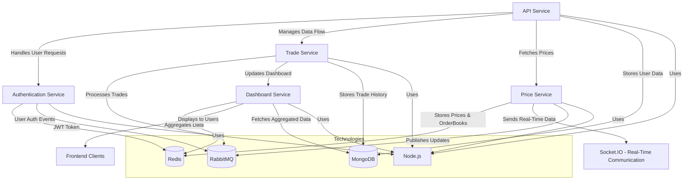

# Project Architecture Diagram for Crypto Prop Trading Platform (BG)

Below is the architecture diagram of the system using Mermaid syntax. This diagram illustrates the structure of the services, their interactions, and the technologies used.

## Explanation of the Diagram

1. **Authentication Service**:
   - Responsible for user authentication.
   - Generates JWT tokens and stores sessions in Redis.
   - Publishes user authentication events to RabbitMQ.

2. **API Service**:
   - Handles all incoming user requests.
   - Communicates with the Authentication Service for user validation.
   - Manages data flow between other services like Trade Service and Price Service.

3. **Price Service**:
   - Manages cryptocurrency prices and order books.
   - Stores price and order book data in Redis.
   - Sends real-time updates to clients via Socket.IO.
   - Publishes price updates to RabbitMQ for other services.

4. **Trade Service**:
   - Processes trades and checks trade conditions.
   - Sends trade-related events to RabbitMQ.
   - Updates the Dashboard Service with trade data.

5. **Dashboard Service**:
   - Aggregates data from various services.
   - Fetches aggregated data from MongoDB and Redis.
   - Displays data to users via the frontend.

6. **Technologies**:
   - **Node.js**: Used as the runtime environment for all services.
   - **MongoDB**: Acts as the main database for storing user data, trade history, and aggregated data.
   - **Redis**: Used for session storage, caching, and real-time data storage (prices and order books).
   - **RabbitMQ**: Acts as the message broker for inter-service communication.

[Diagram Link](https://www.mermaidchart.com/app/projects/317a8c54-d38f-4d22-b3e1-475b73cd6a5c/diagrams/44ba895e-1284-45fe-b08e-9fd056148849/version/v0.1/edit)   
